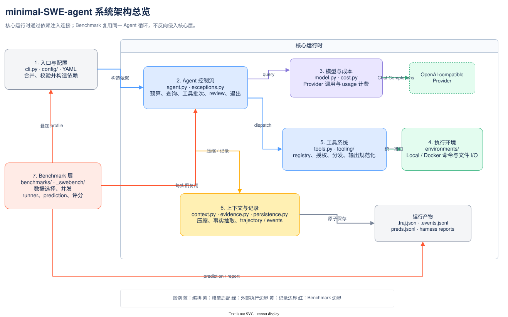

# minimal-SWE-agent

一个用于学习软件工程 Agent 的小型实现：模型选择工具，Agent 执行工具并把结果送回模型，
直到模型提交结果或触发运行上限。项目不依赖 Agent 框架，关键控制流可以直接沿
[`Agent`](src/mini_agent/agent.py) 阅读。

它不是面向生产的编码产品，也不以排行榜成绩为首要目标。这里保留真实系统必须面对的
协议、预算、隔离、上下文压缩、轨迹审计与 benchmark 问题，同时让各层仍可独立阅读和测试。

## 五分钟启动

项目要求 Python 3.10+。仓库开发请使用指定 conda 环境：

```bash
conda run -n minimal-SWE-agent pip install -e ".[dev]"
```

把 provider 密钥放在 `.env`，不要写入 YAML：

```bash
echo 'OPENAI_API_KEY=你的key' > .env
```

运行一个任务：

```bash
conda run -n minimal-SWE-agent minimal \
  --task "列出 src/ 下的模块并说明各自职责"
```

也可以交互输入任务，或通过模块入口启动：

```bash
conda run -n minimal-SWE-agent minimal
conda run -n minimal-SWE-agent python -m mini_agent --task "修复指定 bug"
```

需要保存可复盘结果时指定轨迹路径：

```bash
conda run -n minimal-SWE-agent minimal \
  --task "修复指定 bug" -o runs/example.traj.json
```

这会保存模型最终使用的 context view，并在相邻的 `.events.jsonl` 中保存完整追加式事件。

## 安全边界

默认 `LocalEnvironment` 直接在当前宿主机进程的工作目录执行模型生成的 shell 命令，
并能读写宿主文件；它不是沙箱。只把可信工作区和任务交给本地模式。

Docker 模式提供进程和文件系统隔离，但安全性仍取决于镜像、挂载、转发的环境变量、
容器参数以及 Docker daemon 权限：

```bash
conda run -n minimal-SWE-agent minimal \
  --env docker --image python:3.11-slim --cwd /workspace \
  --task "检查项目"
```

普通默认配置允许网络。SWE-bench profile 额外使用 `--network=none`、命令级网络拦截和
Bash `pipefail`；这些是评测策略，不会自动保护普通本地任务。模型和环境资源会由 CLI 在
`finally` 中调用 `close()` / `cleanup()` 释放，调用库 API 时则由调用者负责生命周期。

默认测试不会选择会调用真实模型 API 的 E2E 测试。不要在未确认费用与 provider 设置时
显式运行 `-m e2e`。默认 token 单价为零；未配置真实价格时，`cost_limit` 不能构成美元保护。

## 极简架构



核心运行以依赖注入组装：`Agent(model, environment, config)`。`Model` 是仓库提供的一个
具体 OpenAI-compatible adapter；Agent 只按 `.query(messages, tools)` 进行鸭子类型调用，
测试可传入 fake。`Environment` 则是显式 ABC，定义 `execute`、`read_file`、`write_file`
与 `cleanup`，当前实现为 local 和 Docker。

项目按七个部分理解最清楚：

1. 入口与配置：`cli.py`、`config/`；
2. Agent 控制流：`agent.py`、`exceptions.py`；
3. 模型与成本：`model.py`、`cost.py`；
4. 执行环境：`environments/`；
5. 工具系统：`tools.py`、`tooling/`；
6. 上下文与记录：`context.py`、`evidence.py`、`persistence.py`；
7. Benchmark 层：`benchmarks/`，其中 `_swebench/` 只承接数据集和存储细节。

完整依赖方向、普通流程与 SWE-bench 流程见
[架构总览](docs/architecture/overview.md)。可编辑源图和导出约定见
[架构图维护](docs/diagrams/README.md)。

## 配置与测试

权威运行默认值在
[`src/mini_agent/config/default.yaml`](src/mini_agent/config/default.yaml)，覆盖优先级为：

```text
default.yaml < --config（从左到右） < MINI_AGENT_* 环境变量 < CLI 参数
```

示例：

```bash
minimal --config my.yaml
minimal -c agent.max_steps=50 -c agent.cost_limit=1.5
MINI_AGENT_AGENT__MAX_STEPS=50 minimal
```

完整字段和覆盖方式见[配置指南](docs/guides/configuration.md)与
[配置参考](docs/reference/configuration.md)。

运行所有非 E2E 测试：

```bash
conda run -n minimal-SWE-agent env PYTEST_DISABLE_PLUGIN_AUTOLOAD=1 \
  python -m pytest tests/ -q -p no:anyio -m "not e2e"
```

不要默认运行 E2E；需要 Docker daemon 的测试会在不可用时跳过。分层与选择方法见
[测试指南](docs/guides/testing.md)。

## SWE-bench

安装可选依赖后，从单实例开始：

```bash
conda run -n minimal-SWE-agent pip install -e ".[bench]"
conda run -n minimal-SWE-agent minimal-swebench \
  --subset verified --split test --instance 0 \
  --model gpt-4o-mini --output runs/smoke
```

批量、断点续跑、输出文件与官方 harness 评分见 [SWE-bench 指南](docs/guides/swebench.md)。

## 文档入口

- [文档首页](docs/index.md)：按学习、运行、审计三条路径阅读；
- [架构](docs/architecture/overview.md)：模块、依赖、循环、工具、环境与记录；
- [指南](docs/guides/configuration.md)：配置、测试和 SWE-bench 操作；
- [参考](docs/reference/configuration.md)：字段、工具、轨迹格式和术语；
- [决策](docs/decisions/design-tradeoffs.md)：历史演进与明确取舍；
- [实验记录](docs/experiments/index.md)：SWE-bench 实验及失败复盘。

参考项目：[mini-swe-agent](https://github.com/swe-agent/mini-swe-agent)；评测基准：
[SWE-bench](https://www.swebench.com/)。
