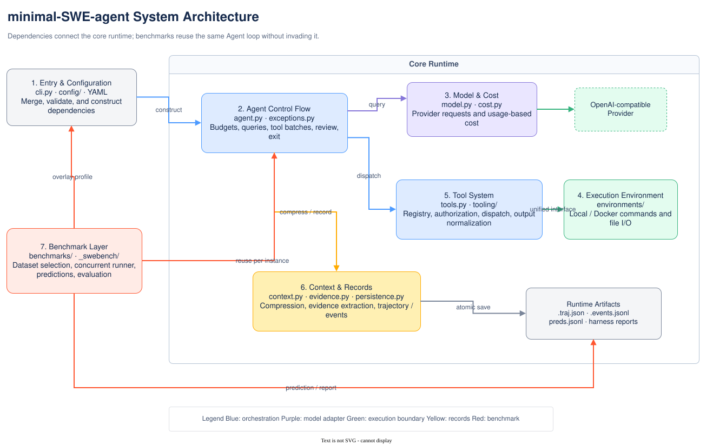

# minimal-SWE-agent

> **Simplified Chinese version:** [README.zh-CN.md](README.zh-CN.md)

A small implementation for learning about software-engineering agents: the model selects tools,
the Agent executes those tools and sends their results back to the model until the model submits a
result or a run limit is reached. The project does not depend on an Agent framework; its key control
flow can be read directly in [`Agent`](src/mini_agent/agent.py).

This is not a production coding product, nor is leaderboard performance its primary goal. It keeps
the protocol, budget, isolation, context compression, trajectory auditing, and benchmark problems
that real systems must address, while keeping each layer independently readable and testable.

## Get started in five minutes

The project requires Python 3.10+. Use the designated conda environment for repository development:

```bash
conda run -n minimal-SWE-agent pip install -e ".[dev]"
```

Put provider keys in `.env`; do not write them into YAML:

```bash
echo 'OPENAI_API_KEY=your-key' > .env
```

Run a task:

```bash
conda run -n minimal-SWE-agent minimal \
  --task "List the modules under src/ and describe each one's responsibility"
```

You can also enter a task interactively or start the module entry point:

```bash
conda run -n minimal-SWE-agent minimal
conda run -n minimal-SWE-agent python -m mini_agent --task "Fix the specified bug"
```

To save a result for later review, specify a trajectory path:

```bash
conda run -n minimal-SWE-agent minimal \
  --task "Fix the specified bug" -o runs/example.traj.json
```

This saves the final context view used by the model and the complete append-only events in the
adjacent `.events.jsonl` file.

## Security boundaries

By default, `LocalEnvironment` executes model-generated shell commands directly in the current
host process's working directory and can read and write host files; it is not a sandbox. Only give
the local mode trusted workspaces and tasks.

Docker mode provides process and filesystem isolation, but its security still depends on the image,
mounts, forwarded environment variables, container arguments, and Docker daemon permissions:

```bash
conda run -n minimal-SWE-agent minimal \
  --env docker --image python:3.11-slim --cwd /workspace \
  --task "Inspect the project"
```

The ordinary default configuration allows network access. The SWE-bench profile additionally uses
`--network=none`, command-level network interception, and Bash `pipefail`; these are evaluation
policies and do not automatically protect ordinary local tasks. The CLI releases model and
environment resources by calling `close()` / `cleanup()` in `finally`; callers are responsible for
the lifecycle when using the library API.

By default, tests that call a real model API are not selected as E2E tests. Do not explicitly run
`-m e2e` without confirming costs and provider settings. The default token prices are zero; without
configured real prices, `cost_limit` cannot serve as a dollar-denominated safeguard.

## Minimal architecture



The core runtime is assembled with dependency injection: `Agent(model, environment, config)`. The
repository provides `Model` as a concrete OpenAI-compatible adapter; the Agent uses it through
duck typing with `.query(messages, tools)`, so tests can inject a fake. `Environment` is an explicit
ABC defining `execute`, `read_file`, `write_file`, and `cleanup`; the current implementations are
local and Docker.

The project is easiest to understand as seven parts:

1. Entry point and configuration: `cli.py`, `config/`;
2. Agent control flow: `agent.py`, `exceptions.py`;
3. Model and cost: `model.py`, `cost.py`;
4. Execution environments: `environments/`;
5. Tool system: `tools.py`, `tooling/`;
6. Context and records: `context.py`, `evidence.py`, `persistence.py`;
7. Benchmark layer: `benchmarks/`, where `_swebench/` handles only dataset and storage details.

For the complete dependency directions, ordinary flow, and SWE-bench flow, see
[Architecture overview](docs/architecture/overview.md). See
[diagram maintenance](docs/diagrams/README.md) for editable sources and export conventions.

## Configuration and testing

The authoritative runtime defaults are in
[`src/mini_agent/config/default.yaml`](src/mini_agent/config/default.yaml), with the following
override precedence:

```text
default.yaml < --config (left to right) < MINI_AGENT_* environment variables < CLI arguments
```

Examples:

```bash
minimal --config my.yaml
minimal -c agent.max_steps=50 -c agent.cost_limit=1.5
MINI_AGENT_AGENT__MAX_STEPS=50 minimal
```

For all fields and override methods, see the [configuration guide](docs/guides/configuration.md) and
[configuration reference](docs/reference/configuration.md).

Run all non-E2E tests:

```bash
conda run -n minimal-SWE-agent env PYTEST_DISABLE_PLUGIN_AUTOLOAD=1 \
  python -m pytest tests/ -q -p no:anyio -m "not e2e"
```

Do not run E2E by default; tests that require a Docker daemon are skipped when it is unavailable.
See the [testing guide](docs/guides/testing.md) for test layers and selection methods.

## SWE-bench

After installing the optional dependencies, start with a single instance:

```bash
conda run -n minimal-SWE-agent pip install -e ".[bench]"
conda run -n minimal-SWE-agent minimal-swebench \
  --subset verified --split test --instance 0 \
  --model gpt-4o-mini --output runs/smoke
```

For batching, resuming from checkpoints, output files, and official harness scoring, see the
[SWE-bench guide](docs/guides/swebench.md).

## Documentation

- [Documentation home](docs/index.md): read along the learning, running, and auditing paths;
- [Architecture](docs/architecture/overview.md): modules, dependencies, loops, tools, environments, and records;
- [Guides](docs/guides/configuration.md): configuration, testing, and SWE-bench operations;
- [Reference](docs/reference/configuration.md): fields, tools, trajectory format, and terminology;
- [Decisions](docs/decisions/design-tradeoffs.md): historical evolution and explicit trade-offs;
- [Experiment records](docs/experiments/index.md): SWE-bench experiments and failure retrospectives.

Reference project: [mini-swe-agent](https://github.com/swe-agent/mini-swe-agent); evaluation benchmark:
[SWE-bench](https://www.swebench.com/).
