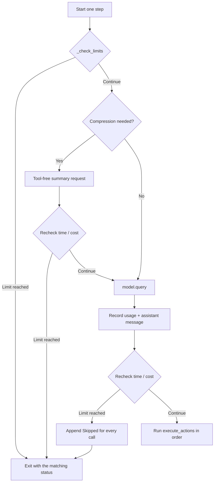

# Agent loop

[`agent.py`](../../src/mini_agent/agent.py) is the system's control plane. It does not handle shell,
file-editing, or HTTP details; it maintains the message protocol within budget, queries the model,
dispatches tools, and produces auditable results.

## Construction and run state

`Agent(model, environment, config)` receives external dependencies. Model only needs to satisfy the
shape of a `.query()` call, while Environment implements the common interface. Construction reads
the context parameters; each `run()` resets the following state:

- `messages`: the context view currently visible to the model;
- `events`: all events appended since this run began;
- `_steps`: the number of model decision rounds in the main loop;
- `n_calls`: the number of API calls, including main and summary queries;
- `cost`: estimated cost accumulated from provider usage;
- `exit_status`, `submission`, `error`: terminal data.

`run()` first writes the system and task messages, then calls `step()` in a loop. `AgentExit`
subclasses represent expected termination; unknown exceptions become structured errors. Whenever an
output path is provided, `finally` attempts to save the trajectory.

## One step



Step limits are checked only when a new decision round starts; the model query that just completed
still belongs to the current valid step. Time or cost can exceed its limit when a query returns, so
the limit is checked again before executing any side-effecting tool. If the run stops at that point,
every tool call already declared by the assistant in this round still receives a skipped observation
to keep the provider protocol complete.

The built-in Model also receives the remaining run time as its request timeout. Tool batches recheck
the deadline before every call, and timeout-aware blocking operations are capped to the remaining
time. If one call consumes the budget, later calls in the same batch are acknowledged as skipped.

## Queries and tool-free responses

Each `query()`:

1. increments `_steps` and `n_calls`;
2. passes schemas for enabled tools to Model;
3. calculates cost from usage in the response;
4. normalizes the assistant message and appends it to `messages`;
5. if there are no tool calls, uses `no_tool_call_retries` to decide whether to correct the response or end with `no_tool_calls`.

Summary requests do not consume `_steps`, but do consume `n_calls`, cost, and wall-clock time. If
the provider has returned usage but the body cannot be parsed, the accounting callback still runs
first so that an already completed request is not omitted from the ledger.

## Tool batches and protocol invariants

An assistant response can contain multiple tool calls. `execute_actions()` processes them in order and
maintains:

```text
assistant(tool_call A, tool_call B, submit C, tool_call D)
tool(A result)
tool(B result)
tool(C Submitted/Draft)
tool(D Skipped)
```

Each `tool_call_id` must correspond to exactly one `role=tool` message. Unknown or disabled tools,
malformed JSON, handler exceptions, and deliberate skips all become observations rather than leaving
orphaned calls. The deadline is checked between calls, so a long first call cannot authorize later
side effects merely because the whole batch passed the initial check.

## submit and review

In the ordinary configuration, a valid `submit(output=...)` appends a confirmation observation and
then raises `Submitted`, exiting after the complete batch has been acknowledged. Tools after submit
do not execute side effects.

When `submission_review_prompt` is configured, the first submit is only a draft:

1. the draft is acknowledged, but the run does not exit;
2. the review prompt is added as a new user message;
3. optional `submission_review_reset_context` returns to the original system + task, reducing author-context anchoring;
4. an optional checkpoint extracts commands, return codes, file paths, and boundaries from events and generates a summary explicitly labeled `untrusted_author_working_memory`;
5. the reviewer can look up events with the read-only `trajectory` tool;
6. only the second submit becomes the final result.

Review is not a second independent Agent, and it receives no hidden evaluator feedback. It is only a
submission gate within the same run; whether it is enabled, whether context is reset, and whether a
checkpoint is created are all determined by profile configuration. The checkpoint switch must be
used together with a review prompt and reset; otherwise pydantic validation rejects the configuration
immediately.

## Exit statuses

| Status | Meaning |
|---|---|
| `submitted` | Final submit accepted |
| `no_tool_calls` | No-tool response with all correction attempts exhausted |
| `max_steps` | Decision-round limit reached before the next round starts |
| `max_time` | Wall-clock budget exhausted |
| `cost_limit` | Configured and computable cost budget exhausted |
| `interrupted` | `KeyboardInterrupt` caught |
| `error` | Unexpected exception |

The CLI then maps these strings to explicit process exit codes. As a library interface,
`Agent.run()` returns a dict for tests or a runner to consume.

## Invariant checklist

- No side-effecting tools are dispatched after a run limit is hit;
- assistant/tool round trips can always be replayed to an OpenAI-compatible provider;
- model context can be compressed, but original events are not overwritten by compression;
- summary and main requests use the same cost accounting;
- a candidate patch from draft review is not treated as trusted evidence;
- run results other than save failures are not lost through a normal exit path.

Related pages: [Tool system](tool-system.md), [Context and records](context-and-records.md),
[Trajectory format](../reference/trajectory-format.md).
