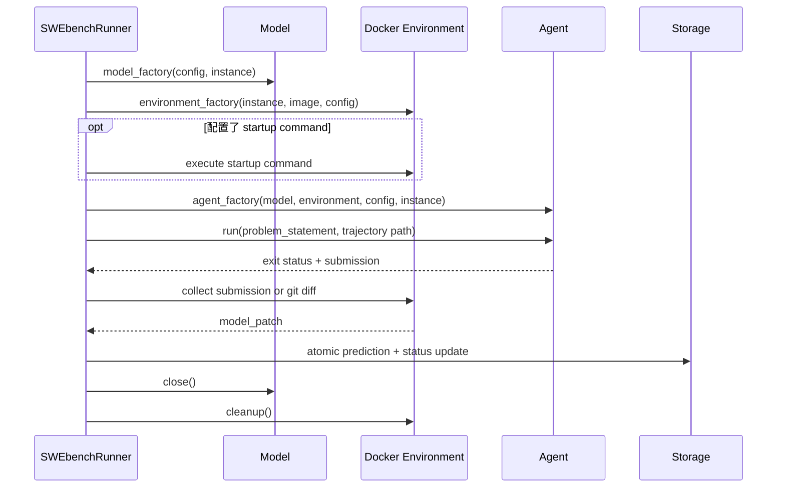

# Benchmark 层

Benchmark 层把通用 Agent 应用于一批外部任务，并负责可恢复的产物管理。它不应把数据集、
存储、官方评分或评测策略塞回 Agent 循环。

## 模块边界

```text
benchmarks/
├── cli.py                 参数解析与 profile 组装
├── swebench.py            runner、factory 注入、单实例生命周期
├── evaluation.py          官方 harness 命令适配与报告收集
└── _swebench/
    ├── dataset.py         数据集别名、过滤、镜像解析
    └── storage.py         predictions 的并发安全原子存储
```

`_swebench/` 表示 runner 的内部支撑层，不是新的顶层 workflow。公开兼容 import 可由
`benchmarks/__init__.py` 暴露，但数据和存储实现留在私有包。

## 配置叠加

benchmark CLI 使用普通
[`default.yaml`](../../src/mini_agent/config/default.yaml) 作为基底，再叠加
[`benchmarks/swebench.yaml`](../../src/mini_agent/config/benchmarks/swebench.yaml)，最后应用
用户 `-c/--config` 与 `--model`。

SWE-bench profile 负责表达评测策略：Docker `/testbed`、断网、pipefail、更长预算、
trajectory 工具和两阶段 submit review。不要把这些差异硬编码到 Agent。

## 数据集层

`_swebench.dataset`：

- 将 `full`、`verified`、`lite`、`multimodal`、`multilingual` 映射到数据集；
- 懒加载可选 `datasets` 依赖；
- 按 regex、slice、seeded shuffle 或 instance id 选择任务；
- 从实例元数据解析官方 Docker image 名称。

排序、slice 和 shuffle 必须可复现。单个 `--instance` 可接受精确 id 或排序后的数字索引，
用于先验证环境、模型和费用设置。

## 单实例生命周期



factories 支持命名参数，也兼容小型测试 lambda 的常见位置签名。默认 factory 延迟 import
Model/Agent，避免仅导入 runner 就要求 API key 或启动容器。

如果 environment startup 失败，已经获得的环境也必须清理。每个并发实例拥有独立模型、
容器与轨迹目录，不能共享可变 Agent 状态。

## 产物

一个输出目录通常包含：

```text
preds.json                  以 instance_id 为键的标准 prediction
preds.jsonl                 官方 harness 输入
statuses.json               可恢复的实例状态
<instance>/<instance>.traj.json
<instance>/<instance>.events.jsonl
```

prediction 使用标准字段 `model_name_or_path`、`instance_id`、`model_patch`。存储层以锁保护
进程内并发更新，并通过临时文件 + replace 原子落盘。

`statuses.json` 属于 runner 的恢复状态，由 `swebench.py` 在同一实例生命周期中更新；它没有
下沉到 prediction storage，因为二者的格式和消费者不同。

轨迹 instance metadata 只允许公开任务与 setup 字段。不得顺手持久化完整数据集 row，因为
其中可能含 gold patch、隐藏测试或 evaluator 脚本，既污染学习材料也破坏评测边界。

## 恢复语义

- 默认跳过已有终局结果；
- `--redo-existing` 明确重做已存在实例；
- `--retry-failed` 只重试失败状态；
- 批次中一个实例失败不应破坏其他已原子保存的结果。

并发主要提高吞吐，也会同时增加 API 费用、镜像/磁盘压力与 Docker 资源占用。先跑单实例，
确认轨迹、patch 和清理行为，再扩大 workers。

## patch 收集

理想 submission 是完整 unified diff。若提交不是 diff，runner 可从环境执行
`git diff --binary --no-ext-diff` 收集实际工作树变更。空 patch、非 submitted 终局或执行
失败必须保留真实状态，不能仅因为生成了 prediction 行就称为 solved。

## 官方评分

`evaluation.py` 构造 SWE-bench harness 命令，校验 run id，运行子进程并读取报告。评分是
独立阶段：

```text
Agent submitted ──不等于── patch valid ──不等于── harness resolved
```

网络、镜像、容器启动、依赖和 harness 自身失败都要与模型 patch 失败分层归因。实验报告
应同时记录 generation exit status 与官方 resolved 结果。

## 安全与公平性

SWE-bench 容器用 `--network=none` 阻断外部检索；bash 网络命令识别只是补充。`pipefail`
确保 `pytest | tail` 不会用 tail 的零状态掩盖测试失败。review 只能依据 issue、仓库、可用
测试和自己的轨迹，不接收隐藏 evaluator 反馈。

使用说明见[SWE-bench 指南](../guides/swebench.md)，历史实验见
[实验索引](../experiments/index.md)。
