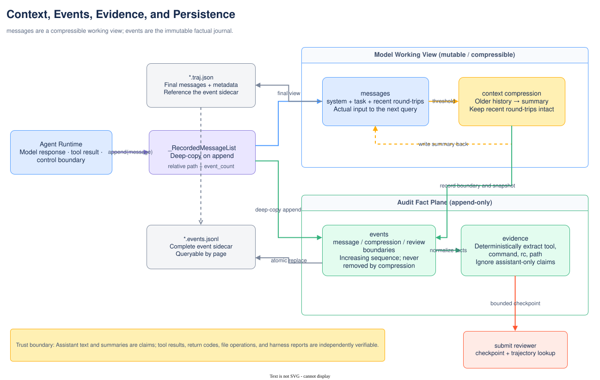

# Context and records

A run maintains working memory, raw events, extracted evidence, and persisted artifacts at the same
time. Calling all of them a "trajectory" hides an important distinction: the content actually seen
by the model can be compressed, while the audit ledger cannot be overwritten by compression.

## Four objects

| Object | Location | Lossy? | Purpose |
|---|---|---|---|
| `messages` | `Agent.messages` / `.traj.json` | Context-compressed | Working context for the next model query |
| `events` | `Agent.events` / `.events.jsonl` | Append-only | Reconstruct actual messages, compression, and review boundaries |
| `evidence` | Deterministically extracted from events | Selective but not model-generated | Commands, return codes, files, errors, and sequence indexes |
| persistence | `persistence.py` | Does not interpret content | Atomically write the trajectory and separate the event sidecar |

Model-generated summaries remain claims, not evidence. An evidence checkpoint deliberately ignores
tool-free assistant narration while preserving original event sequences for reviewer lookups.



Edit the source in draw.io: [context-records-en.drawio](../diagrams/context-records-en.drawio).
The upper half is the mutable model working view, while the lower half is the append-only audit fact
plane; neither can replace the other.

## messages: model working context

It starts with the system prompt and rendered task, then appends assistant(tool calls) and tool
observations. `_RecordedMessageList` deep-copies each append into an event; context compression
replaces messages by slicing and does not delete raw events.

The OpenAI-compatible protocol requires each call declared by an assistant to be immediately
followed by its matching tool response. Compression therefore first uses `group_round_trips()` to
make each assistant + all tool responses an atomic unit and never cuts through one.

## Automatic compression

`context.py` uses a provider-independent character approximation to estimate tokens and includes tool
schemas in the budget. When the estimate reaches `threshold × (context_window - reserve)`:

```text
[system, original task] + middle history + recent units
                    │
                    ▼ summarize
[system, original task] + [CONTEXT SUMMARY] + recent units
```

The old summary is folded in with newly summarized middle history rather than nested layer by layer.
The most recent N round trips are preserved unchanged. A summary is a tool-free model request, so it
counts toward API calls, cost, and time, but not the main-loop step.

Summary failure is non-fatal: the complete messages are retained and the run continues. However,
the request may already have occurred, so Agent rechecks cost and wall-clock limits before the main
query continues. Successful compression records a `context_compression` event and the exact
`context_messages` snapshot from that time.

Do not copy parameter defaults from this page; see the `agent` section of
[`default.yaml`](../../src/mini_agent/config/default.yaml).

## events: append-only event ledger

Actual system/user/assistant/tool messages are recorded as events with `type=message`. Control
boundaries such as compression and review reset use dedicated event types. Each item has an
increasing `sequence`; when output is configured, events are also appended to the sidecar as the run
proceeds. The final save atomically overwrites it with the complete in-memory events.

Failure to write a streaming event does not interrupt Agent; the error is added to trajectory
metadata, and the final save tries again. This is an observability trade-off, not a transaction
system.

## evidence: machine-fact index

`evidence.py` normalizes events with different provider shapes into `EventFact` and extracts:

- tool name, call ID, and associated sequence;
- bash command and return code;
- file paths for read/edit/write;
- execution errors and bounded output;
- context-compression and draft-review boundaries;
- omitted assistant-only claims and malformed-event counts.

`build_review_checkpoint()` bounds both item and character counts and inserts an omission marker
between the beginning and end. It does not judge whether a patch is correct or treat author
narration as independent proof.

## Handoff for submit review

With clean-context review enabled, the first submit is a draft. Agent can reset messages to the
original system + task and append:

1. a deterministic author-evidence checkpoint;
2. a model summary explicitly marked as untrusted navigation information;
3. the candidate patch;
4. the review prompt.

The final submit round trip containing the candidate patch is not sent to the summarizer, avoiding a
large diff taking up the context window twice. The reviewer can use the `trajectory` tool to paginate
raw-event queries by query, sequence, event type, role, tool, or return code.

## persistence: two files

`Agent.serialize()` generates `mini-agent-0.2` data containing final messages, run metadata, and
in-memory events. `save_trajectory_data()` moves events to the adjacent JSONL and writes this to the
main file:

```json
{"event_log": {"path": "run.events.jsonl", "format": "mini-agent-events-0.1", "event_count": 42}}
```

The two files are replaced atomically separately, but this is not a cross-file transaction; a sudden
power loss can still leave an inconsistent pair. Consumers should check the format, event_count, and
relative path instead of assuming completeness from the filename alone.

## Audit order

1. first inspect `info.exit_status`, error, submission, API calls, and cost;
2. determine whether `.traj.json.messages` contains a summary; it represents only the final context;
3. open the sidecar at `event_log.path` and verify event_count;
4. verify assistant claims using tool call/result pairs, return codes, and file facts;
5. check the harness report separately for benchmark results; do not equate a successful submit with an issue being resolved.

See the [trajectory format](../reference/trajectory-format.md) for all fields. See [design
trade-offs](../decisions/design-tradeoffs.md) for the rationale behind the design.
