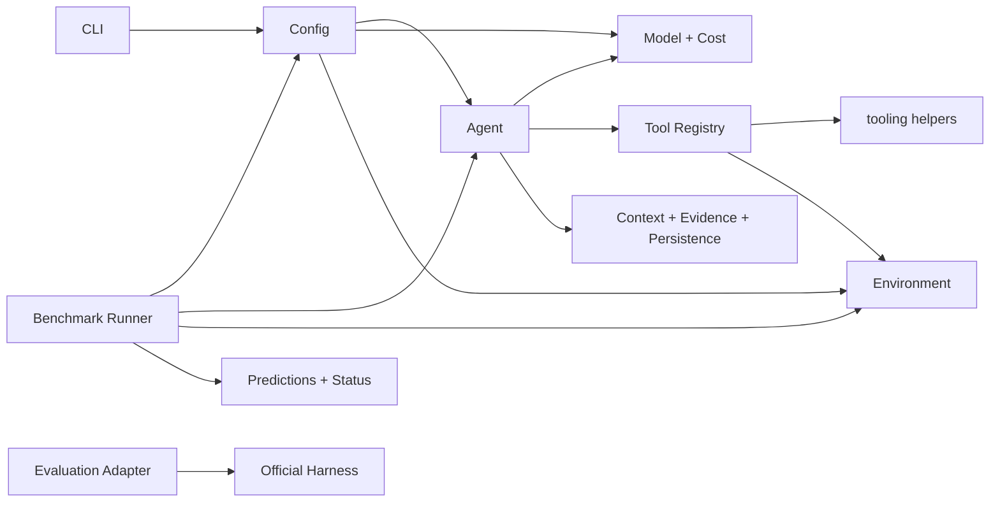
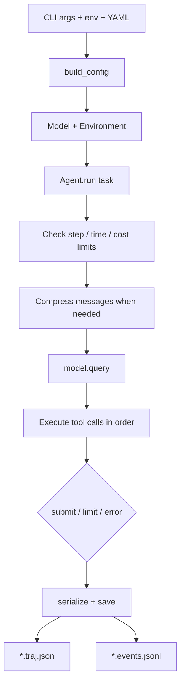
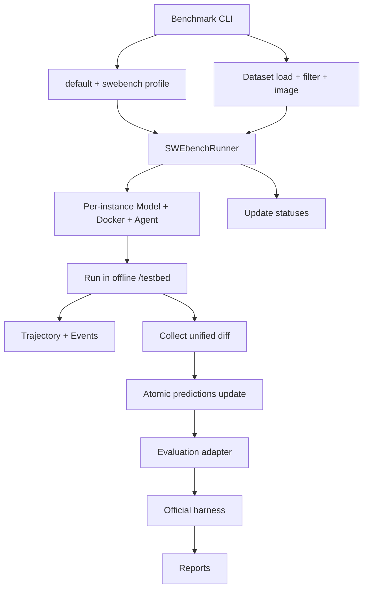

# Architecture overview

The core of minimal-SWE-agent is not a particular model, but a control flow connecting replaceable
dependencies. The entry point constructs `Config`, a model, and an environment; `Agent` only
orchestrates messages and tools, while persistence and benchmarks reuse the core as boundary layers.

## Seven parts

| Part | Submodules | Responsibilities |
|---|---|---|
| 1. Entry point and configuration | `cli.py`, `__main__.py`, `config/__init__.py`, `config/models.py`, YAML | Merge and validate configuration, construct dependencies, map process exit codes |
| 2. Agent control flow | `agent.py`, `exceptions.py` | Loop, budgets, queries, tool batches, review, and exit |
| 3. Model and cost | `model.py`, `cost.py` | OpenAI-compatible calls and usage accounting |
| 4. Execution environments | `environments/base.py`, `local.py`, `docker.py`, `factory.py` | Command and file I/O, and resource cleanup |
| 5. Tool system | `tools.py`, `tooling/schemas.py`, `files.py`, `output.py`, `network.py`, `types.py` | Registration, authorization, argument dispatch, and output normalization |
| 6. Context and records | `context.py`, `evidence.py`, `persistence.py` | Compression, fact extraction, atomic saves, and the event sidecar |
| 7. Benchmark layer | `benchmarks/cli.py`, `swebench.py`, `evaluation.py`, `_swebench/dataset.py`, `storage.py` | Dataset selection, concurrent runs, prediction storage, and official harness integration |

`tools.py` retains the stable public entry point and runtime orchestration; concrete reusable
components live in `tooling/`. `benchmarks/swebench.py` retains the runner; SWE-bench-specific
dataset parsing and prediction storage live in `benchmarks/_swebench/`, preventing generic benchmark
orchestration from becoming a miscellaneous single-file layer again.

## Dependency directions

Lower-level modules should not import the CLI in reverse. `config` does not depend on Agent, Model,
or Environment, so it can validate data first. `tooling` is the leaf layer for tool implementations;
`Agent` does not implement file or network policies directly.

## Ordinary run flow

The CLI owns the resources it creates. Whether the run succeeds, the Agent reports an error, or
input validation fails, `finally` closes Model first and then cleans up Environment; library callers
assume the same responsibility.

## SWE-bench flow

Runner concurrency only coordinates instances; each instance still uses the same Agent loop. If
environment creation or execution fails, the runner attempts to clean up resources that were
created. Trajectories retain only public task metadata; do not copy gold patches, hidden tests, or
evaluator scripts beside the model records.

## Key boundaries

- Model is a concrete adapter, but Agent uses it through `.query(...)` duck typing;
- Environment is an ABC that enforces a consistent command and file-operation interface;
- schemas and handlers form pairs in the registry, while `tools.enabled` controls both visibility and execution permission;
- `messages` is compressible working context, while `events` is an uncompressible factual ledger;
- evidence extracts machine-observable facts only from events and does not promote assistant conclusions to facts;
- persistence owns the format and atomic writes but does not decide when Agent exits;
- a benchmark profile can tighten policies without changing the ordinary profile's default semantics.

## Security boundaries

The Local environment has no isolation, and Docker is not unconditionally safe. Network-command
detection only provides early feedback; the actual SWE-bench network boundary is the container's
`--network=none`. Output truncation protects model context but does not limit the data a command can
access. Cost limits are effective only when non-zero, real prices are configured.

Continue reading: [Agent loop](agent-loop.md), [Tool system](tool-system.md),
[Models and environments](model-and-environments.md), [Context and records](context-and-records.md),
[Benchmark layer](benchmark-layer.md).
