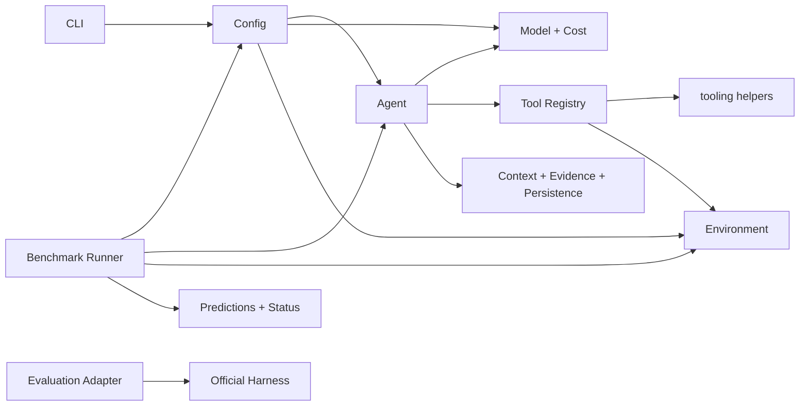
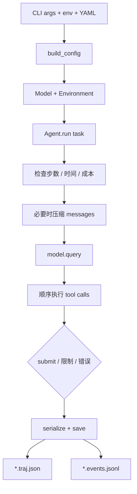
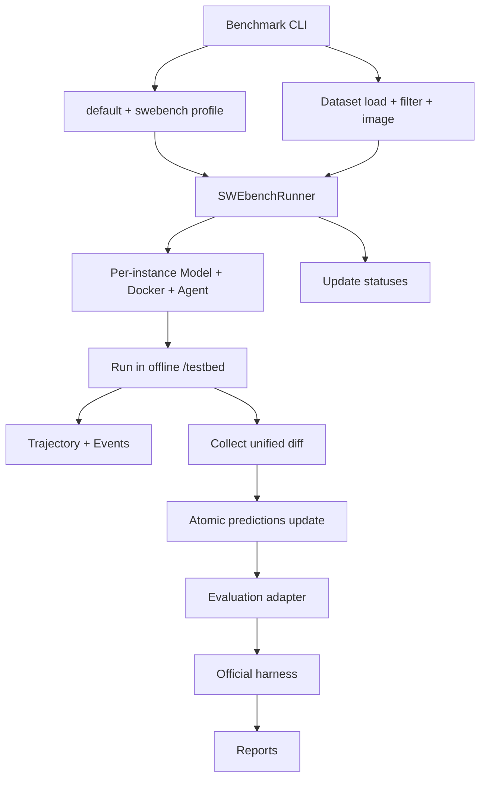

# 架构总览

minimal-SWE-agent 的核心不是某个模型，而是一条可替换依赖之间的控制流。入口构造
`Config`、模型和环境，`Agent` 只编排消息与工具，持久化和 benchmark 作为边界层复用核心。

源图可在 draw.io 中编辑：[system-overview.drawio](../diagrams/system-overview.drawio)。图用于快速
建立整体心智模型；模块职责、约束和例外仍以本页文字为准。

## 七个部分

| 部分 | 子模块 | 职责 |
|---|---|---|
| 1. 入口与配置 | `cli.py`、`__main__.py`、`config/__init__.py`、`config/models.py`、YAML | 合并配置、校验、构造依赖、映射进程退出码 |
| 2. Agent 控制流 | `agent.py`、`exceptions.py` | 循环、预算、查询、工具批次、review、退出 |
| 3. 模型与成本 | `model.py`、`cost.py` | OpenAI-compatible 调用、usage 计费 |
| 4. 执行环境 | `environments/base.py`、`local.py`、`docker.py`、`factory.py` | 命令与文件 I/O、资源清理 |
| 5. 工具系统 | `tools.py`、`tooling/schemas.py`、`files.py`、`output.py`、`network.py`、`types.py` | 注册、授权、参数分发、输出规范化 |
| 6. 上下文与记录 | `context.py`、`evidence.py`、`persistence.py` | 压缩、事实抽取、原子保存与事件 sidecar |
| 7. Benchmark 层 | `benchmarks/cli.py`、`swebench.py`、`evaluation.py`、`_swebench/dataset.py`、`storage.py` | 数据选择、并发运行、prediction 存储、官方 harness 适配 |

`tools.py` 保留稳定公共入口和运行时编排，具体可复用构件位于 `tooling/`。
`benchmarks/swebench.py` 保留 runner；SWE-bench 专属的数据解析和 prediction 存储位于
`benchmarks/_swebench/`，防止通用 benchmark 编排再次变成单文件杂物层。

## 依赖方向

底层模块不应反向 import CLI。`config` 不依赖 Agent、Model 或 Environment，因此可先完成
数据校验。`tooling` 是工具实现的叶子层；`Agent` 不直接实现文件或网络策略。

## 普通运行流程

CLI 拥有它创建的资源。无论成功、Agent 错误还是输入异常，都在 `finally` 中先关闭 Model，
再清理 Environment；库调用者自行承担相同责任。

## SWE-bench 流程

runner 的并发只协调实例；单实例仍走同一个 Agent 循环。环境创建或运行失败时，runner 会
尝试清理已创建资源。轨迹只保留公开任务元数据，不应把 gold patch、隐藏测试或 evaluator
脚本复制到模型记录旁。

## 关键边界

- Model 是具体 adapter，但 Agent 对它采用 `.query(...)` 鸭子类型；
- Environment 是 ABC，强制命令和文件操作接口一致；
- schema 与 handler 在 registry 成对，`tools.enabled` 同时控制可见性和执行权限；
- `messages` 是可压缩工作上下文，`events` 是不可压缩事实账本；
- evidence 只从事件抽机器可观察事实，不把 assistant 结论升级成事实；
- persistence 负责格式和原子写入，不决定 Agent 何时退出；
- benchmark profile 可以收紧策略，但不改变普通 profile 的默认语义。

## 安全边界

Local 环境没有隔离；Docker 也不是无条件安全。网络命令识别只提供提前反馈，真正的
SWE-bench 网络边界是容器的 `--network=none`。输出截断保护模型上下文，不限制命令本身
能访问的数据。成本上限只有在配置非零真实单价时有效。

继续阅读：[Agent 循环](agent-loop.md)、[工具系统](tool-system.md)、
[模型与环境](model-and-environments.md)、[上下文与记录](context-and-records.md)、
[Benchmark 层](benchmark-layer.md)。
