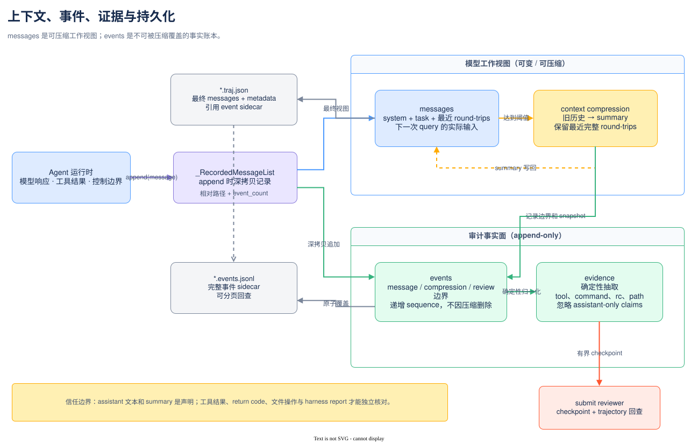

# 上下文与记录

一次运行同时维护工作记忆、原始事件、抽取证据和落盘产物。把它们混称为“trajectory”会
掩盖重要差异：模型实际看到的内容可以压缩，审计账本不能被压缩覆盖。

## 四种对象

| 对象 | 位置 | 是否有损 | 用途 |
|---|---|---|---|
| `messages` | `Agent.messages` / `.traj.json` | 会被上下文压缩 | 下一次模型查询的工作 context |
| `events` | `Agent.events` / `.events.jsonl` | append-only | 重建实际消息、压缩与 review 边界 |
| `evidence` | 从 events 确定性抽取 | 有选择但非模型生成 | 命令、return code、文件、错误和序号索引 |
| persistence | `persistence.py` | 不解释内容 | 原子写 trajectory，分离事件 sidecar |

模型生成的 summary 仍是声明，不是证据。evidence checkpoint 则刻意忽略无工具的 assistant
叙述，并保留原事件序号，供 reviewer 回查。



源图可在 draw.io 中编辑：[context-records.drawio](../../diagrams/context-records.drawio)。图中
上半部是会变化的模型工作视图，下半部是追加式审计事实面；两者不能互相替代。

## messages：模型工作上下文

初始为 system prompt 与渲染后的任务，随后追加 assistant(tool calls) 和 tool observations。
`_RecordedMessageList` 在 append 时把深拷贝写入事件；上下文压缩用切片替换 messages，
不会把原始事件删除。

OpenAI-compatible 协议要求 assistant 声明的每个 call 紧随匹配的 tool response。压缩因此
先用 `group_round_trips()` 把 assistant + 全部 tool responses 组成原子单元，绝不从中切断。

## 自动压缩

`context.py` 用供应商无关的字符近似估算 token，并把工具 schemas 计入预算。当估算量达到
`threshold × (context_window - reserve)` 时：

```text
[system, original task] + middle history + recent units
                    │
                    ▼ summarize
[system, original task] + [CONTEXT SUMMARY] + recent units
```

旧 summary 会与新增的中间历史 fold-in，而不是层层嵌套。最近 N 个 round-trip 原样保留。
summary 是无工具模型请求，计入 API calls、费用和时间，但不计主循环 step。

摘要失败是非致命的：保留完整 messages 继续。不过请求可能已经发生，因此 Agent 会在继续
主查询前复查费用和墙钟。成功压缩会记录 `context_compression` 事件以及当时的精确
`context_messages` snapshot。

参数默认值不要从本文复制，见
[`default.yaml`](../../../src/mini_agent/config/default.yaml) 的 `agent` section。

## events：追加式事件账本

真实 system/user/assistant/tool 消息以 `type=message` 事件记录。压缩和 review reset 等控制
边界使用专门事件类型。每项有递增 `sequence`，在配置 output 时还会边运行边追加 sidecar；
最终保存再以完整内存事件进行原子覆盖。

流式 event 写入失败不会中断 Agent，错误会进入 trajectory metadata，最终保存仍再尝试。
这是一种 observability 取舍，不是事务系统。

## evidence：机器事实索引

`evidence.py` 将 provider 形态不同的事件归一为 `EventFact`，抽取：

- tool name、call id 和关联 sequence；
- bash command 与 return code；
- read/edit/write 的文件路径；
- execution error 与有限输出；
- context compression 和 draft review 边界；
- 被省略的 assistant-only claims 与畸形事件计数。

`build_review_checkpoint()` 对条数和字符数设界，并在头尾之间插入遗漏标记。它不会判断
patch 是否正确，也不会把作者叙述当作独立证明。

## submit review 的交接

启用 clean-context review 时，首次 submit 是 draft。Agent 可把 messages 重置为原始
system + task，再附上：

1. 确定性的 author evidence checkpoint；
2. 明确标记为不可信导航信息的模型摘要；
3. candidate patch；
4. review prompt。

候选 patch 所在的最后一个 submit round-trip 不送进 summarizer，避免大 diff 重复占窗口。
reviewer 可使用 `trajectory` 工具按 query、sequence、event type、role、tool 或 return code
分页查询原始事件。

## persistence：两个文件

`Agent.serialize()` 生成 `mini-agent-0.2` 数据，包含最终 messages、运行 metadata 和内存
events。`save_trajectory_data()` 将 events 移到相邻 JSONL，并在主文件写入：

```json
{"event_log": {"path": "run.events.jsonl", "format": "mini-agent-events-0.1", "event_count": 42}}
```

两个文件分别原子替换，但不是跨文件事务；突然断电仍可能得到不一致的一对。消费端应检查
format、event_count 和相对路径，而不是仅凭文件名假定完整。

## 审计顺序

1. 先看 `info.exit_status`、error、submission、API calls 和 cost；
2. 判断 `.traj.json.messages` 是否含 summary，它只代表最终 context；
3. 按 `event_log.path` 打开 sidecar，并核对 event_count；
4. 用 tool call/result、return code 与文件事实验证 assistant 声明；
5. benchmark 结果另查 harness report，不把成功 submit 等同于 issue resolved。

完整字段见[轨迹格式](../reference/trajectory-format.md)。设计来由见
[设计取舍](../decisions/design-tradeoffs.md)。
